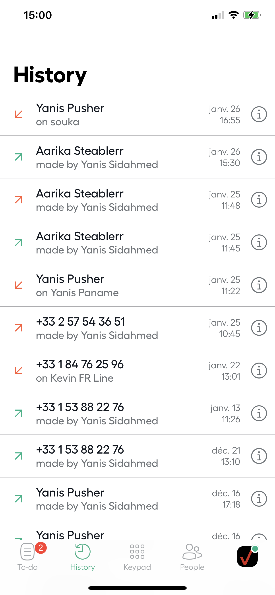
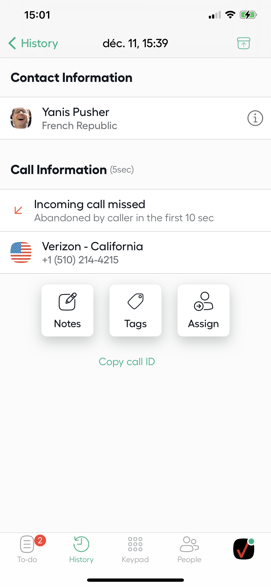

# Aircall - iOS Technical test

  

## Summary

  

The purpose of this test is to give you an opportunity to showcase your coding skills.

To doing so, you will build a small Aircall iOS app from scratch.

  

### General rules

- You are free to use the architecture you prefer

- You are free to use the libraries you want

- You are free to use UIKit or SwiftUI

- The app must compatible with iOS 13+

  

### Things you need to implement

1. Display a ****list of calls**** page

2. Click on call from the list will redirect to ****call details**** page

3. You should be able to ****archive a call**** from List and Details page

=> Archived calls will no longer be visible from ****list of calls****

  

### Where to focus

1. We will pay attention on the architecture of your app

2. The quality of your tests

3. The clarity and documentation of your code

4. Don't pay too much attention on design stuff, it's not a criteria for us. After all, you are a developer not a designer !

  

List of calls |  Call details

:-------------------------:|:-------------------------:

 | 

  

### Need help ?

  

Don't hesitate to ask any question regarding the test at ios@aircall.io

  

  

## API documentation

  

### Routes

  

Here is the API address: https://aircall-job.herokuapp.com.

  

As you can see, it's hosted on a free Heroku server, which means that the first time you will fetch the API, it will take few seconds to answer.

  

- ****GET**** - https://aircall-job.herokuapp.com/activities: get calls to display in the Activity Feed

- ****GET**** - https://aircall-job.herokuapp.com/activities/:id: retrieve a specific call details

- ****POST**** - https://aircall-job.herokuapp.com/activities/:id: update a call. The only field updatable is `is_archived (bool)`. You'll need to send a JSON in the request body:

```

{

is_archived: true

}

```

- ****GET**** - https://aircall-job.herokuapp.com/reset: Reset all calls to initial state (usefull if you archived all calls).

  

  

### Call object

  

- ****id**** - unique ID of call

- ****created_at**** - creation date

- ****direction**** - `inbound` or `outbound` call

- ****from**** - caller's number

- ****to**** - callee's number

- ****via**** - Aircall number used for the call

- ****duration**** - duration of a call (in seconds)

- ****is_archived**** - call is archived or not

- ****call_type**** - can be a `missed`, `answered` or `voicemail` call.

  

  

## Submission

  
You are ready, submit a pull request on this repository and ping your point of contact at Aircall.

Don't forget to include a ****README**** file with the following:

- Write a brief outline of the architecture of your app.
- Explain why you decided to use each third party libraries.
- What was the most difficult part of the challenge ?
- Estimate your percentage of completion and how much time you would need to finish
